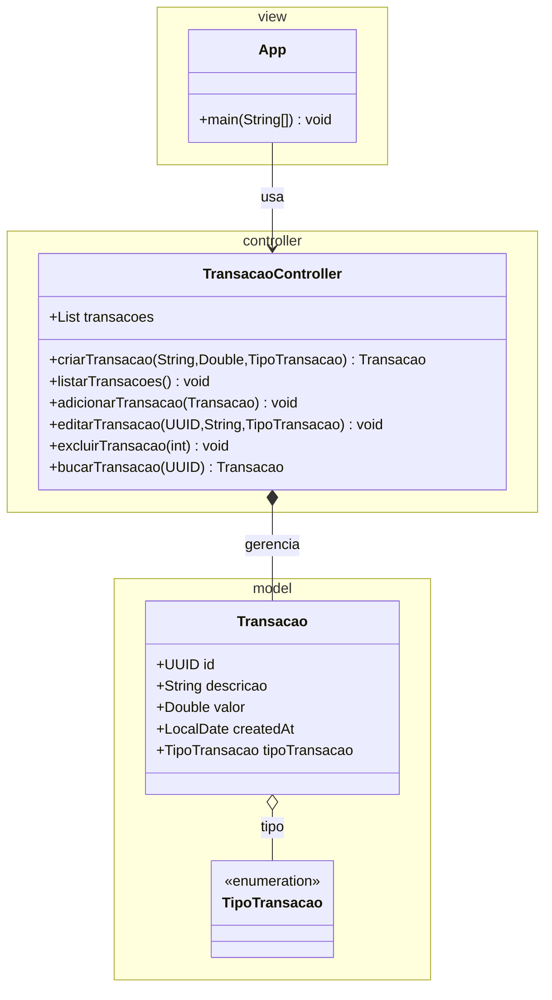

# Sistema Financeiro TUI
## Descrição
Um sistema de gerenciamento financeiro simples com interface de terminal (TUI) usando JLine para Java.

## Estrutura do Projeto
```
src/
├── main/java/br/org/zephyr/
│   ├── model/
│   │   ├── Transacao.java      # Entidade principal
│   │   └── TipoTransacao.java  # Enum dos tipos
│   ├── controller/
│   │   └── TransacaoController.java # Controlador MVC
│   └── view/
│       └── App.java            # Interface principal
├── test/java/                  # Testes unitários
├── .devcontainer/              # Dev Container config
├── pom.xml                     # Configuração Maven
└── README.md                   # Documentação do projeto
```

## Diagrama de Classes (MVC)


## Funcionalidades
### ✅ CRUD de Transações
- **Create**: Criação de novas transações com validação de dados
- **Read**: Listagem e visualização de transações com formatação
- **Update**: Edição de transações existentes por ID
- **Delete**: Exclusão segura com confirmação

### ✅ Interface JLine
- Menu interativo no terminal
