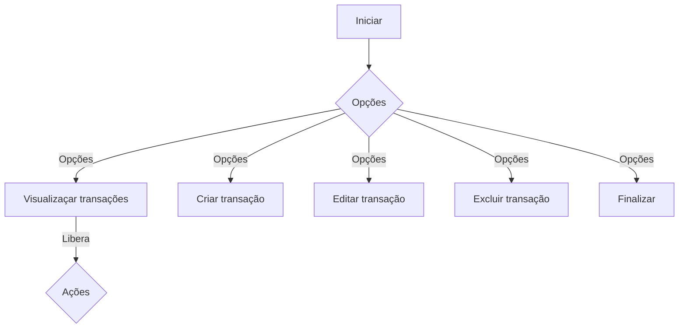

# Sistema Financeiro
## Objetivo

Construir um projeto básico de sistema financeiro com Java usando a biblioteca JLine para ter um shell bonitinho

## Glossário

- Transação → Ato de recebimento ou gasto de dinheiro. Ex: Compra de celular, recebimento de salario

## Requisitos

- O Shell precisa ser capaz de:
    - Permitir a criação, visualização, atualização e exclusão de Transações
    - Permitir usar um export das transações dos meus bancos para criar uma serie de transações de uma unica vez.
    - Puxar as transações de um banco de dados relacional

### Fluxo básico

1. Usuário inicia o shell
2. Usuário tem um menu:
    1. Visualizar transações → mostra uma tabela com todas as transações já feitas ate a data
    2. Criar transações
    3. Editar transações
    4. Excluir transações
    5. Sair do Shell

## Ações

- [ ]  Construir as classes base
- [ ]  Aplicar as técnicas do Jline
