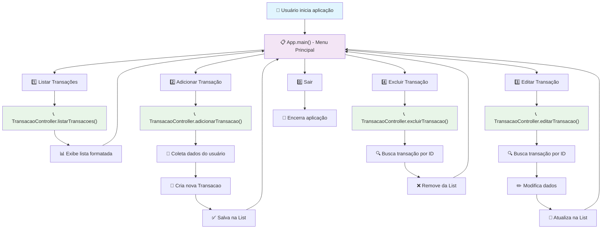

# Sistema Financeiro TUI


## Descrição

Sistema financeiro com interface de linha de comando (TUI) desenvolvido em Java, utilizando a biblioteca JLine para criar uma experiência de terminal interativa e amigável. O sistema implementa o padrão arquitetural MVC (Model-View-Controller), fornecendo uma separação clara de responsabilidades entre as camadas de apresentação, lógica de negócio e modelo de dados.

O sistema permite gerenciar transações financeiras com operações CRUD completas, interface de terminal avançada com navegação intuitiva, e persistência robusta de dados. A arquitetura MVC facilita a manutenção, testabilidade e extensibilidade do código.

## Objetivo

Construir um projeto básico de sistema financeiro com Java usando a biblioteca JLine para ter um shell bonitinho que permita:
- Gerenciamento completo de transações financeiras
- Interface de linha de comando intuitiva e responsiva  
- Arquitetura MVC bem estruturada e organizizada
- Código limpo, testável e de fácil manutenção

### Glossário
- **Transação** → Ato de recebimento ou gasto de dinheiro. Ex: Compra de celular, recebimento de salário
- **MVC** → Model-View-Controller, padrão arquitetural que separa a aplicação em três camadas interconectadas

## Arquitetura

O sistema segue o padrão **MVC (Model-View-Controller)** com a seguinte organização:

- **Model** (`br.org.zephyr.model`): Contém as entidades de domínio e regras de negócio
- **View** (`br.org.zephyr.view`): Responsável pela interface com o usuário (TUI)
- **Controller** (`br.org.zephyr.controller`): Gerencia a lógica de aplicação e coordena Model e View

Esta separação garante baixo acoplamento, alta coesão e facilita a manutenibilidade do código.

## Fluxo Básico



## Estrutura das Classes

```mermaid
classDiagram
    class App {
        +main(String[] args) void
        +exibirMenu() void
        +processarOpcao(int opcao) void
        -scanner: Scanner
        -controller: TransacaoController
    }
    
    class TransacaoController {
        -transacoes: List~Transacao~
        +listarTransacoes() void
        +adicionarTransacao() void
        +editarTransacao(Long id) void
        +excluirTransacao(Long id) void
        +buscarPorId(Long id) Transacao
        +obterTodasTransacoes() List~Transacao~
    }
    
    class Transacao {
        -id: Long
        -descricao: String
        -valor: BigDecimal
        -dataCreated: LocalDateTime
        -tipo: TipoTransacao
        +getId() Long
        +getDescricao() String
        +getValor() BigDecimal
        +getDataCreated() LocalDateTime
        +getTipo() TipoTransacao
        +setId(Long id) void
        +setDescricao(String descricao) void
        +setValor(BigDecimal valor) void
        +setTipo(TipoTransacao tipo) void
    }
    
    class TipoTransacao {
        <<enumeration>>
        ENTRADA
        SAIDA
        INVESTIMENTO
    }
    
    %% Relacionamentos MVC
    App ||--|| TransacaoController : "controla via"
    TransacaoController ||--o{ Transacao : "gerencia coleção de"
    Transacao ||--|| TipoTransacao : "possui tipo"
    
    %% Anotações de camada
    App : <<View Layer>>
    TransacaoController : <<Controller Layer>>
    Transacao : <<Model Layer>>
    TipoTransacao : <<Model Layer>>
    
    %% Estilos
    classDef viewStyle fill:#e3f2fd,stroke:#1976d2,stroke-width:2px
    classDef controllerStyle fill:#e8f5e8,stroke:#388e3c,stroke-width:2px  
    classDef modelStyle fill:#fff3e0,stroke:#f57c00,stroke-width:2px
    
    class App viewStyle
    class TransacaoController controllerStyle
    class Transacao modelStyle
    class TipoTransacao modelStyle
```

## Tecnologias

- **Java 17+** - Linguagem de programação principal
- **JLine 3.x** - Biblioteca para interface de linha de comando avançada
- **Maven** - Gerenciador de dependências e build
- **JUnit** - Framework de testes unitários
- **Dev Containers** - Ambiente de desenvolvimento containerizado

## Requisitos

- Java 17 ou superior
- Maven 3.6+
- Docker (opcional, para Dev Container)

### Funcionalidades Principais

O Shell precisa ser capaz de:
- Permitir a criação, visualização, atualização e exclusão de Transações (CRUD)
- Interface interativa com navegação por menus
- Validação de dados de entrada
- Armazenamento em memória com List<Transacao>

## Como Executar

### Usando Maven
```bash
# Clonar o repositório
git clone https://github.com/filoroch/tui-sistema-financeiro.git
cd tui-sistema-financeiro

# Compilar o projeto
mvn clean compile

# Executar a aplicação
mvn exec:java -Dexec.mainClass="br.org.zephyr.view.App"
```

### Usando Dev Container
```bash
# Abrir no VS Code com Dev Containers
code .
# Pressionar Ctrl+Shift+P e executar: "Dev Containers: Reopen in Container"
```

## Estrutura do Projeto

```
sistema-financeiro/
├── src/main/java/br/org/zephyr/
│   ├── model/
│   │   ├── Transacao.java      # Entidade principal do sistema
│   │   └── TipoTransacao.java   # Enum com tipos de transação
│   ├── controller/
│   │   └── TransacaoController.java  # Lógica de negócio e CRUD
│   └── view/
│       └── App.java            # Interface TUI e ponto de entrada
├── pom.xml                     # Configuração Maven
└── README.md                   # Documentação do projeto
```

## Funcionalidades

### ✅ CRUD de Transações
- **Create**: Criação de novas transações com validação de dados
- **Read**: Listagem e visualização de transações com formatação
- **Update**: Edição de transações existentes por ID
- **Delete**: Exclusão segura com confirmação

### ✅ Interface JLine
- Menu interativo no terminal
- Navegação intuitiva com opções numeradas
- Formatação rica de saída de dados
- Validação de entrada do usuário

### ✅ Arquitetura MVC
- Separação clara de responsabilidades
- Baixo acoplamento entre camadas
- Código testável e maintível
- Estrutura organizacional consistente

## Roadmap

- [x] Construir as classes base do MVC
- [x] Implementar operações CRUD básicas
- [x] Criar interface TUI com menu
- [ ] Adicionar persistência com H2 Database
- [ ] Implementar validações avançadas
- [ ] Adicionar importação/exportação CSV
- [ ] Criar testes unitários abrangentes
- [ ] Adicionar suporte a múltiplas contas
- [ ] Implementar filtros e buscas avançadas
- [ ] Criar relatórios financeiros
- [ ] Adicionar gráficos ASCII para visualização

## Contribuindo

1. Fork o projeto
2. Crie sua feature branch (`git checkout -b feature/AmazingFeature`)
3. Commit suas mudanças (`git commit -m 'Add some AmazingFeature'`)
4. Push para a branch (`git push origin feature/AmazingFeature`)
5. Abra um Pull Request

## Links Úteis

- [JLine Documentation](https://github.com/jline/jline3/wiki)
- [Maven Getting Started](https://maven.apache.org/guides/getting-started/)
- [Java 17 Documentation](https://docs.oracle.com/en/java/javase/17/)
- [Dev Containers Documentation](https://containers.dev/)
- [Mermaid Documentation](https://mermaid.js.org/)

---

**Desenvolvido com ❤️ usando Java, Maven e JLine**
