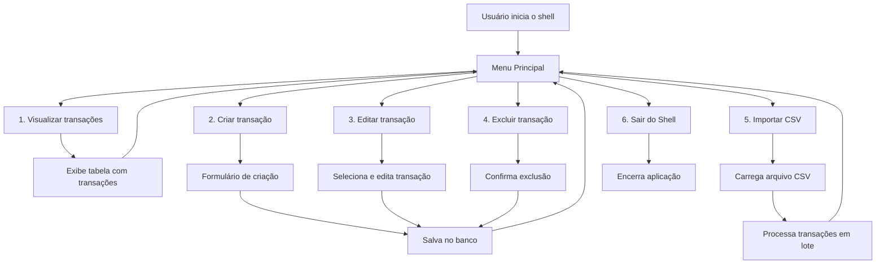
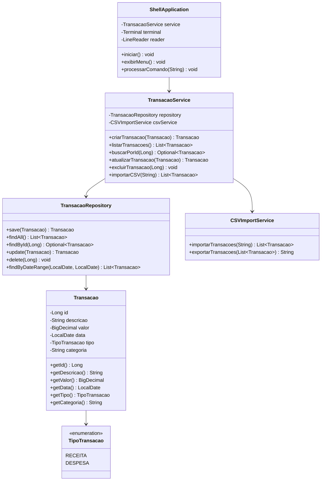

# Sistema Financeiro TUI


## Descrição

Sistema financeiro com interface de linha de comando (TUI) desenvolvido em Java, utilizando a biblioteca JLine para criar uma experiência de terminal interativa e amigável. O sistema permite gerenciar transações financeiras com operações CRUD, importação de dados via CSV e persistência em banco de dados relacional.

## Objetivo

Construir um projeto básico de sistema financeiro com Java usando a biblioteca JLine para ter um shell bonitinho que permita:

- Gerenciamento completo de transações financeiras
- Interface de linha de comando intuitiva e responsiva
- Importação em lote de dados bancários
- Persistência robusta com banco de dados relacional

### Glossário
- **Transação** → Ato de recebimento ou gasto de dinheiro. Ex: Compra de celular, recebimento de salário

## Tecnologias

- **Java 17+** - Linguagem de programação principal
- **JLine 3.x** - Biblioteca para interface de linha de comando avançada
- **OpenCSV** - Biblioteca para importação/exportação de arquivos CSV
- **H2 Database** - Banco de dados relacional embarcado
- **Maven** - Gerenciador de dependências e build
- **Dev Containers** - Ambiente de desenvolvimento containerizado

## Requisitos

- Java 17 ou superior
- Maven 3.6+
- Docker (opcional, para Dev Container)

### Funcionalidades Principais

O Shell precisa ser capaz de:
- Permitir a criação, visualização, atualização e exclusão de Transações (CRUD)
- Permitir usar um export das transações dos bancos para criar uma série de transações de uma única vez
- Puxar as transações de um banco de dados relacional
- Interface interativa com navegação por menus

## Fluxo Básico



## Estrutura das Classes



## Como Rodar

### Pré-requisitos
- Java 17+
- Maven 3.6+

### Execução Local

```bash
# Clone o repositório
git clone https://github.com/filoroch/tui-sistema-financeiro.git
cd tui-sistema-financeiro

# Compile e execute
mvn clean compile exec:java
```

### Usando Dev Container

O projeto inclui configuração para Dev Container. Exemplo de configuração:

```json
{
  "name": "Sistema Financeiro Java",
  "image": "mcr.microsoft.com/devcontainers/java:17-jdk-bookworm",
  "features": {
    "ghcr.io/devcontainers/features/java:1": {
      "version": "17",
      "installMaven": true
    }
  },
  "customizations": {
    "vscode": {
      "extensions": [
        "vscjava.vscode-java-pack",
        "redhat.vscode-xml"
      ],
      "settings": {
        "java.configuration.runtimes": [
          {
            "name": "JavaSE-17",
            "path": "/usr/local/sdkman/candidates/java/17.0.8-tem"
          }
        ]
      }
    }
  },
  "forwardPorts": [8080],
  "postCreateCommand": "mvn clean install"
}
```

## Funcionalidades

### ✅ CRUD de Transações
- **Create**: Criação de novas transações com validação de dados
- **Read**: Listagem e visualização de transações com filtros
- **Update**: Edição de transações existentes
- **Delete**: Exclusão segura com confirmação

### ✅ Importação CSV (OpenCSV)
- Suporte para importação em lote de arquivos CSV
- Mapeamento automático de colunas
- Validação e tratamento de erros
- Formato esperado: `data,descricao,valor,tipo,categoria`

### ✅ Persistência Relacional
- Banco de dados H2 embarcado
- Mapeamento objeto-relacional
- Transações ACID
- Schema automático na inicialização

### ✅ Interface JLine
- Autocompletar de comandos
- Histórico de comandos
- Navegação com setas
- Cores e formatação rica
- Tabelas formatadas para exibição de dados

## Roadmap

- [x] Construir as classes base
- [x] Aplicar as técnicas do JLine
- [ ] Implementar validações avançadas
- [ ] Adicionar suporte a múltiplas contas
- [ ] Criar relatórios financeiros
- [ ] Implementar backup automático
- [ ] Adicionar gráficos ASCII
- [ ] Suporte a diferentes moedas
- [ ] Integração com APIs bancárias
- [ ] Sistema de categorização automática
- [ ] Exportação para múltiplos formatos
- [ ] Interface web complementar

## Links Úteis

- [JLine Documentation](https://github.com/jline/jline3/wiki)
- [OpenCSV Documentation](http://opencsv.sourceforge.net/)
- [H2 Database Documentation](https://h2database.com/html/main.html)
- [Maven Getting Started](https://maven.apache.org/guides/getting-started/)
- [Java 17 Documentation](https://docs.oracle.com/en/java/javase/17/)
- [Dev Containers Documentation](https://containers.dev/)

---

**Desenvolvido com ❤️ usando Java e JLine**
